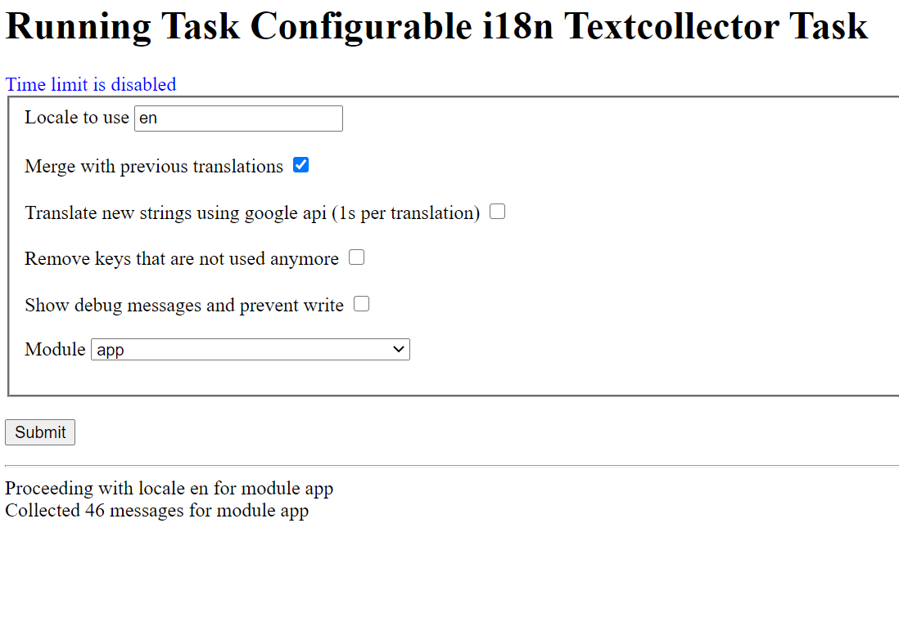
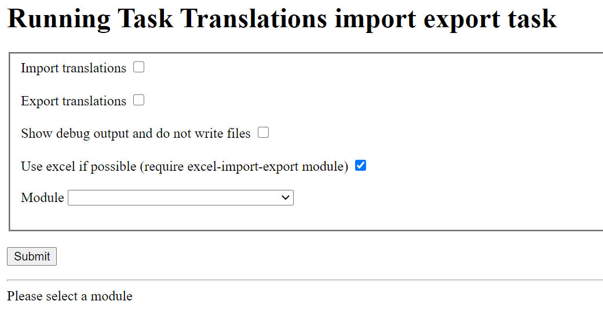

# SilverStripe i18n tools module

## Intro

Provide some helper tools when working with Fluent and multilingual websites

## LangHelper

The `LangHelper` class provide a consistent i18n function regardless of Fluent being installed or not.

You can call global translation under the "Global" entity. These are accessible with LangHelper::globalTranslation or g() shortcut.

## FluentLocale only if cookies are enabled

This module disable by default `persist_cookie` for Fluent.

You need to make sure to call `LangHelper::persistLocaleIfCookiesAreAllowed` (works with two types of cookie consent modules)
or call with your own logic `LangHelper::persistLocale`.

## Improved text collector task

This improved text collector helps you to collect translation from specific modules.

It supports merge (even of older version of SilverStripe, that now does that as well), auto translating new string from google api,
clear unused strings...

This is available from a convenient interface.

## Translations import/export task

Collecting translations for customers is not always easy. In order to provide a simple mean to collect label,
everything can be exported to a csv file. This will create as many columns as the number of .yml files in your `lang` folder.

It can then be imported back from the file to your yml files.

If you use lekoala/silverstripe-excel-import-export, this file can be exported in xlsx.

This is available from a convenient interface.

## Todo

- Make BuildTaskTools into a specific module

## Compatibility

Tested with 4.6 but should work on any ^4 projects

## Maintainer

LeKoala - thomas@lekoala.be
